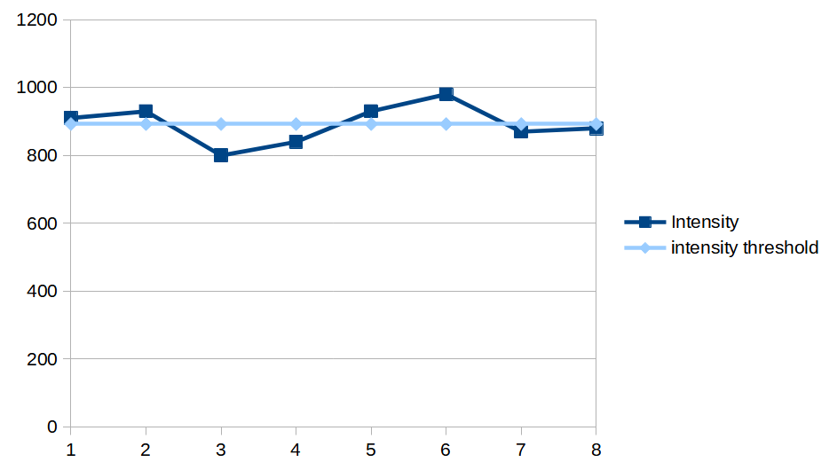
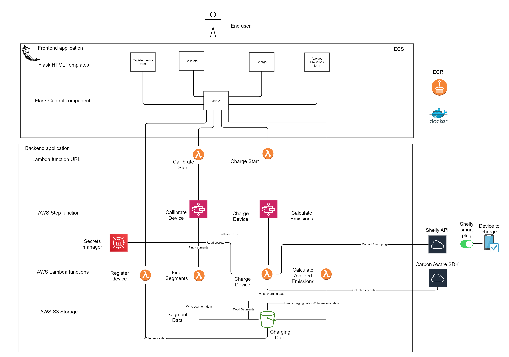
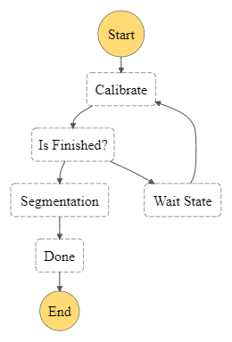
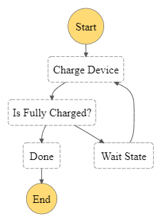

# Green charge


Green charge is Visma Connect's contribution to the carbon hack 22 hackathon

## Introduction

More and more devices use batteries. Think of mobile phones, tablets, ear phones, laptops, but also e-bikes and escooters. All these devices need charging.
The electricity used for charging can be green or... not so green. So if we charge in a smart and green way a lot of carbon emissions can be avoided.

Some devices you first charge and then use like an e-bike or e-scooter.
Other devices you can have connected to the grid while operating it, like a laptop.

## Security

As this application is created for a hackathon and time was limited, our time was spent on creating the basic functionality. No particular effort has been put into security. SO CONSIDER THIS APPLICATION TO BE NOT SECURE!

## Smart plug

Smart plugs are devices that can turn on and off devices they are connected to. Additionally to can also monitor the power used by the connected device.

Using such smart plugs we created a system that can switch on or off the charging of the device based on the grid's carbon intensity.

For this hackathon we're using the Shelly plug S (https://www.shelly.cloud/products/shelly-plug-s-smart-home-automation-device/). It can be operated using API calls over the internet.

## Battery characteristics

Modern lithium-ion batteries have certain load characteristics. When the battery is over 80% charged it will start charging slower and slower to prevent overcharging the battery.

We make use of these characteristics.
If the smart plug measures high power, it means the battery is more empty.
If the smart plug measures low power, it means the battery is nearly full.

As every battery has their own curve we first need to callibrate on the specific battery.
This callibration is done by doing a full charging process when the battery is empty while monitoring the power.

After that we use an AI algoritm to divide the power curve in segments:


The blue segment is the segment where the battery is fairly low.
The red segment shows when the battery is almost full.

## Charging

Using the Watt Time API GreenCharge knows the forecasted carbon intensities for the region where the charging takes place.
Using this information GreenCharge calculates the intensity threshold which acts as a switch to switch the smart plug on and off.



## User journeys

Using the greenest possible energy resulted in two user journeys:
- Charging mode: Charge the device within a set time llmit and do it in the greenest way possible. 
- Operating mode: The person operates the device and wants to do that in the greenest way possible.

### Charging mode:

The charging mode of the GreenCharge system lets you charge the battery of your device - say your e-bike - in the greenest way possible.

The process is like this:
1. The battery is callibrated and we know the boundaries of the segments.
2. The charging process:
    1. Set the time frame by which the battery needs to be fully charged.
    2. Iterative process:
        1. Calculate intensity threshold using forecasted intensities.
        2. Check current intenstity.
        3. Determine current battery charge percentage.
            1. IF intensity is lower than intensity threshold THEN charge.
            2. IF intensity is higher than intensity threshold THEN don't charge.

### Operating mode

The operating mode of the GreenCharge system lets you operate your device - say your laptop - in the greenest way possible.

The process is like this:
1. The battery is callibrated and we know the boundaries of the segments.
2. The charging process:
    1. Iterative process:
        1. Calculate intensity threshold using forecasted intensities.
        2. Check current intenstity.
        3. Determine current battery charge percentage.
            1. IF intensity is low AND battery load is low THEN charge.
            2. IF intensity is high AND battery load is low THEN disconnect from the grid.

## Architecture

The application allows the user to charge their device.



A number of technologies have been used in this application:
- Host platform Linux
- AWS Services used:
-- Lambda functions
-- Step functions
-- ECS
-- ECR
-- Secrets manager
- Programming language used:
-- Python 3.8, 3.9
- Frontend framework: Python Flask

The application is hosted on AWS services. It consists of a number of parts:
- Secrets manager: This is were we store credentials etc.
- A backend application: A combination of step functions and lambda functions
- A frontend application: A Dockerized Python Flask application which runs on an ECS cluster.

### Secrets manager

If you want to deploy this application yourself then create a secret:
- Secret name: WATT_TIME
Add the following secret values:
- WATT_TIME_USER_NAME: 
- WATT_TIME_PASSWORD: 
- WATT_TIME_BASE_URL: e.g. https://api2.watttime.org/v2

### Back end application

-- There are these services:
--- Device registration: Register a device that you want to charge and input all information needed to access the smart plug.
--- Calibration: Calibration is needed to get to know the battery's characteristics.
--- Charging: Charging the battery given certain time constraints.
--- Calculation of avoided emissions: Calculate what emissions have been avoided by using this application rather than charging in the normal way.

Each of these services have been implemented using the same setup:
- A lambda function URL is a function that can be accessed from the internet to start off the step function.
- A Step function that describes the process, it's a state machine. This involves switching on and off to use the energy when it's greenest.
- A lambda function which implements the business logic.

These a the two step functions:

Calibration:


Charging:


The backend application is a serverless application so it's as green is possible and doesn't need services to be up 24/7. We host it in Stockholm which is the greenest AWS Data center in Europe.

### Frontend application

The frontend application is a Python Flask application. The application is dockerized and is hosted on an AWS ECS cluster.


## Deployment

### Deployment of lambda functions

In order to deploy the lambda functions the create_stack.sh scripts need to be run in their respective deployment* directories.
The scripts expect two arguments:
- The AWS account id
- The AWS region
- The AWS user name
Both are needed to identify a role needed for the lambda.

To facilitate this each deployment* directory has a file called run_create_stack.sh. In these files you can fill in your details and then run them.
Example: ./create_stack.sh -i '455212390693' -u 'Green-Charge-Users'

5 of the lambda functions have external URLs. The cloud formation scripts sets it option including the permissions, but something goes wrong there. Therefore it's needed to create the permission from the browser.

The following functions have a function URL:
- CalibrateStartFunctionDev
- CalculateAvoidedEmissionsFunctionDev
- ChargeProgressFunctionDev 
- ChargeStartFunctionDev
- RegisterDeviceFunctionDev

Copy the URL for each of the functions as you'll need them in the frontend application.
You can find it in the configuration tab of the lambda function.

Note: The cloudformation scripts for the lambda functions with a function URL have code it them to create the permissions to allow the functions to be executed. This doesn't work. Adding the permissions from the AWS UI will solve this problem.

### Deployment of webapplication

#### ECR Repository
First you need to create a private ECR repository.
You'll need the name in the following section

#### Tune bash scripts
In the UI directory there are two scripts:
- docker_build_aws.sh
- docker_build_local.sh

These scripts needs to be tailored to your specific situation:
```bash
# Details about your AWS account and region
export AWS_ACCOUNT_ID=<>
export AWS_REGION=<>

# Fill in the URL of the lambda function the webapp uses. Be sure to leave out the https:// part
# example:
# export CALIBRATE_START_LAMBDA_FUNCTION_URL=g5swxdn56l3v6g3k1g66lj0ahq0jbhhi.lambda-url.eu-north-1.on.aws
export CALIBRATE_START_LAMBDA_FUNCTION_URL=<>
export CHARGE_START_LAMBDA_FUNCTION_URL=<>
export CHARGE_PROGRESS_LAMBDA_FUNCTION_URL=<>
export PERFORM_REGISTRATION_LAMBDA_FUNCTION_URL=<>
export CALCULATE_AVOIDED_EMISSIONS_LAMBDA_FUNCTION_URL=<>

# Create an ECR repository for the application and put the name here.
export ECR_REPOSITORY=<>
```
#### Create docker image
Once that's done you can run the script.
- The local script will store the docker file locally. Docker run will make the application available under http://127.0.0.1
- The AWS script will store the docker file in ECR repository you created.

#### Deploy docker image on AWS ECS

To deploy the web application please refer to this tutorial:
https://acloudguru.com/blog/engineering/deploying-a-containerized-flask-application-with-aws-ecs-and-docker


